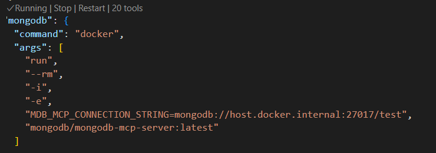
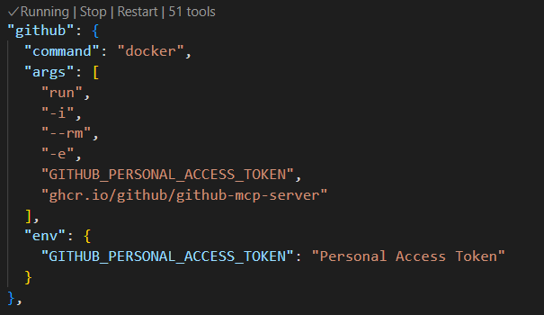
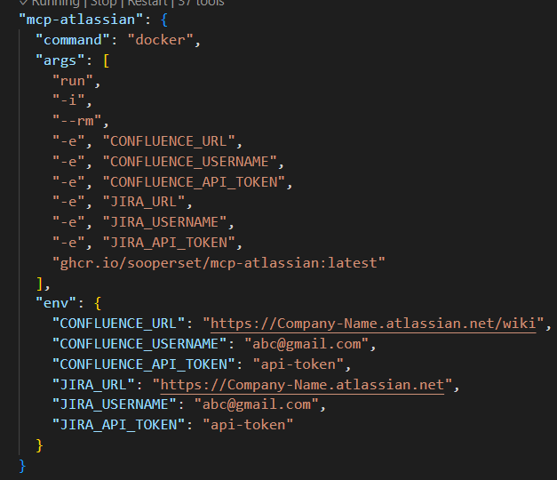

# Hackathon2025
MCP servers are added for below listed tools. To run these servers user need docker to be installed in the local machine.
- Time (Enableing AI models to interact with real-world time-sensitive data and tools) - 
- MongoDB
    The configuration is done for locally running mongodb where db name is "test".
    
- GitHub()
    The "Personal Access Token" required to replace with actual personal access token generated from github.
    
- Atlassian (Jira and Confluence)
    This is a community server not the official one so recommended to use personal Atlassian account to avoid any misshappens.
    
    "Company-Name" needs to replace with actual one. CONFLUENCE_USERNAME and JIRA_USERNAME needs to replace with actual email address which will be same. CONFLUENCE_API_TOKEN and JIRA_API_TOKEN needs to replace with the actual token which will be same.
    To create API token : https://id.atlassian.com/manage-profile/security/api-tokens